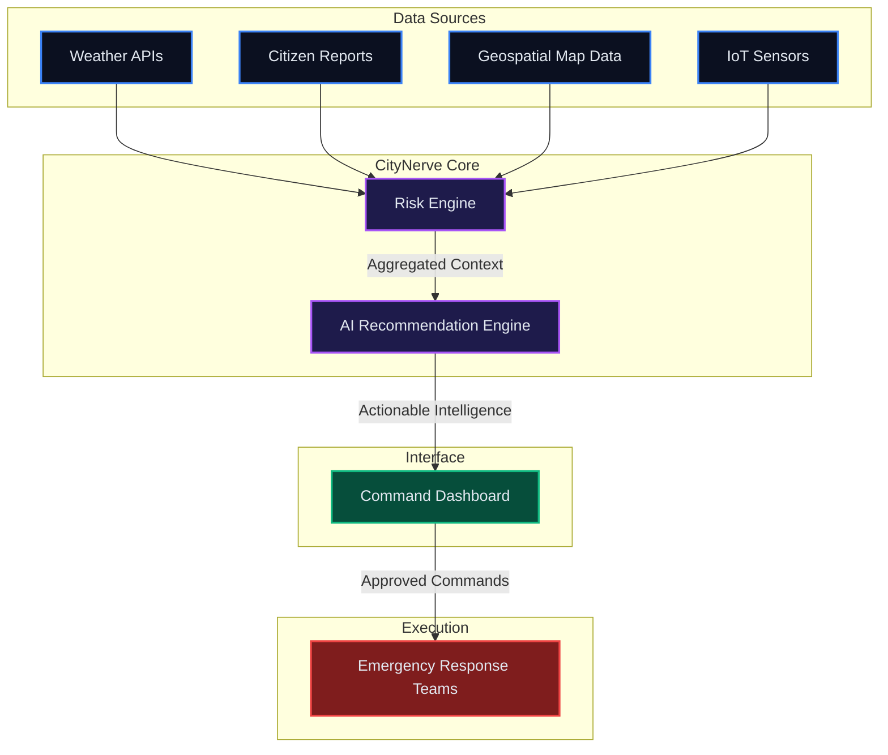

<div align="center">

# 🌐 CityNerve

**The AI Nervous System for Disaster-Ready Cities**

*CityNerve is a unified intelligence platform that transforms fragmented urban data into predictive, actionable emergency response strategies.*

<br />

[](https://nextjs.org/)
[](https://reactjs.org/)
[](https://www.typescriptlang.org/)
[](https://tailwindcss.com/)
<br />
[](https://www.python.org/)
[](https://fastapi.tiangolo.com/)
[](https://www.mongodb.com/)
[](https://opensource.org/licenses/MIT)

<br />

<!-- Placeholder for Hero Image -->


</div>

---

## 📖 Overview

CityNerve is an AI-powered Disaster Intelligence & Decision Support Platform engineered for modern Emergency Operations Centers (EOC). Rather than simply presenting raw data on a map, CityNerve acts as a cognitive engine for urban resilience. It ingests complex geospatial intelligence, live weather telemetry, and citizen reports, synthesizing them through explainable AI to provide commanders with clear, actionable intervention strategies before crises escalate.

Designed with a Palantir-inspired, enterprise-grade architecture, CityNerve moves emergency management from reactive observation to proactive orchestration.

---

## 🚨 The Problem

Modern disaster management is fundamentally hindered by information friction. When seconds matter, decision-makers face critical bottlenecks:

*   **Fragmented Intelligence:** Data lives in silos. Weather alerts, social media sentiment, and infrastructure status require manual reconciliation across disparate systems.
*   **Reactive Posture:** Traditional systems notify operators *after* a threshold is breached, inherently delaying response times.
*   **Cognitive Overload:** During a crisis, EOC operators are overwhelmed by raw alerts rather than guided by synthesized operational priorities.
*   **Black-Box Algorithms:** Existing AI solutions often provide risk scores without the transparency required for high-stakes governmental decision-making.

---

## 💡 Our Solution

CityNerve transforms raw environmental noise into a unified, high-fidelity operational picture. Our platform operates on a four-pillar methodology:

> [!IMPORTANT]
> **Detect:** Aggregate real-time telemetry from IoT sensors, weather APIs, and verified citizen reports.
>
> **Understand:** Contextualize anomalies against infrastructure vulnerabilities and historical data models.
>
> **Predict:** Utilize forecasting algorithms to anticipate crisis vectors (e.g., flash flood spread within 30 minutes).
>
> **Respond:** Generate concrete, explainable action plans (e.g., "Deploy Team Bravo, Close Route 4") requiring only one-click command approval.

---

## ✨ Features

*   **🗺️ Interactive Risk Map:** High-performance, WebGL-accelerated geospatial visualization highlighting active incidents, critical infrastructure, and dynamic risk zones.
*   **🧠 AI Command Intelligence:** Automated synthesis of multi-modal data into prioritized, actionable recommendations.
*   **📱 Citizen Reporting Integration:** Streamlined ingestion of localized crisis data from civilian sources.
*   **🔍 Explainable AI:** Transparent confidence scoring and logical breakdowns for every AI-generated recommendation.
*   **🌊 Flood Prediction Engine:** Hyper-local hydrological modeling to forecast urban inundation.
*   **⚡ Command Feed:** A real-time, timestamped operational ledger tracking all dispatches, advisories, and systemic alerts.
*   **📊 Operational Dashboard:** A unified, dark-mode command center designed to reduce eye strain and maximize cognitive focus during extended operations.
*   **🚑 Emergency Resource Monitoring:** Real-time tracking and utilization metrics for field units, shelters, and medical facilities.

---

## 🏗️ Architecture



---

## 🛠️ Tech Stack

| Domain | Technologies |
| :--- | :--- |
| **Frontend** | Next.js 16 (App Router), React 19, TypeScript, Tailwind CSS v4, Framer Motion |
| **Backend** | Python, FastAPI |
| **AI / ML** | PyTorch, Hugging Face, OpenAI APIs |
| **Database** | MongoDB, PostgreSQL (PostGIS) |
| **Mapping** | Mapbox GL, react-map-gl |
| **Deployment** | Vercel (Frontend), Docker, AWS (Backend) |

---

## 📂 Project Structure

```text
citynerve/
├── app/                  # Next.js 16 App Router pages and layouts
│   ├── dashboard/        # Core EOC Dashboard route
│   ├── layout.tsx        # Root layout, fonts, and global providers
│   └── page.tsx          # Landing page (placeholder)
├── components/           # Modular React components
│   ├── ai/               # AI recommendation panels
│   ├── cards/            # KPI metrics and incident detail cards
│   ├── layout/           # Sidebar, TopNavbar, and structural shells
│   ├── map/              # WebGL map and layer controls
│   ├── timeline/         # Live command feed
│   └── ui/               # Reusable shadcn/ui base components
├── constants/            # Application configuration and design tokens
├── data/                 # Mock datasets for UI development
├── hooks/                # Custom React hooks (state, map layers, clock)
├── lib/                  # Utility functions (Tailwind merge, etc.)
├── types/                # Strict TypeScript interface definitions
└── public/               # Static assets
```

---

## 🚀 Getting Started

### Prerequisites
*   Node.js (v18 or higher)
*   npm or yarn
*   Mapbox Access Token

### Installation

1. **Clone the repository:**
   ```bash
   git clone https://github.com/Aaryan-2903/citynerve.git
   cd citynerve
   ```

2. **Install dependencies:**
   ```bash
   npm install
   ```

3. **Configure Environment Variables:**
   Create a `.env.local` file in the root directory and add your Mapbox token:
   ```env
   NEXT_PUBLIC_MAPBOX_TOKEN=your_mapbox_access_token_here
   ```

4. **Run the development server:**
   ```bash
   npm run dev
   ```

5. **Access the application:**
   Open [http://localhost:3000](http://localhost:3000) in your browser. The dashboard is available at `/dashboard`.

---

## 🛣️ Roadmap

- [x] **Planning:** Define architecture, component structure, and design system.
- [x] **UI:** Design Palantir-inspired, dark-mode enterprise interface.
- [x] **Frontend:** Implement responsive layout, Framer Motion animations, and Mapbox scaffolding.
- [ ] **Backend:** Develop FastAPI microservices for data ingestion and routing.
- [ ] **AI:** Integrate predictive models and LLM-based recommendation synthesis.
- [ ] **Simulation:** Build disaster scenario simulation engine for testing and training.
- [ ] **Presentation:** Finalize documentation, pitch deck, and demo environment.

---

## 📸 Screenshots

<details>
<summary><b>Landing Page</b></summary>
<br>

</details>

<details>
<summary><b>Operational Dashboard</b></summary>
<br>

</details>

<details>
<summary><b>AI Command Center</b></summary>
<br>

</details>

<details>
<summary><b>Disaster Simulation Module</b></summary>
<br>

</details>

---

## 🎬 Demo

*   🔗 **Live Demo:** [Placeholder Link]
*   📹 **Demo Video:** [Placeholder Link]
*   📄 **Presentation:** [Placeholder Link]

---

## 🔮 Future Scope

CityNerve is built to scale. Future integrations include:

*   🚁 **Drone Integration:** Automated dispatch of reconnaissance drones to critical incident coordinates.
*   📡 **IoT Sensors:** Direct ingestion of water level, seismic, and structural stress sensor telemetry.
*   🔥 **Forest Fire Prediction:** Expansion of predictive models to include wildfire spread vectors utilizing satellite thermal imaging.
*   🎙️ **Voice AI:** Hands-free command execution for EOC operators via secure voice interfaces.
*   📱 **Mobile App:** A stripped-down companion app for field responders to receive AI directives and report ground truth.

---

## 🤝 Contributing

We welcome contributions from the community. CityNerve is an ambitious project, and we value expertise in geospatial analysis, UI/UX design, machine learning, and systems architecture.

Please read our [Contributing Guidelines](CONTRIBUTING.md) for details on our code of conduct, development workflow, and pull request process.

---

## 📄 License

This project is licensed under the MIT License - see the [LICENSE](LICENSE) file for details.

---

## ✍️ Author

**Aryan Mandal**

*   **GitHub:** [@Aaryan-2903](https://github.com/Aaryan-2903)
*   **LinkedIn:** [Placeholder for LinkedIn URL]

<br />
<div align="center">
  <i>Built to protect. Designed to empower.</i>
</div>
