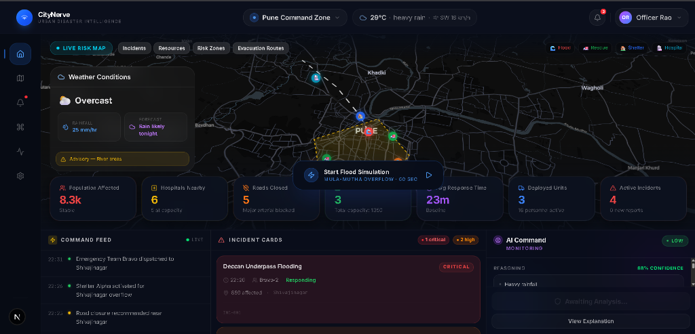
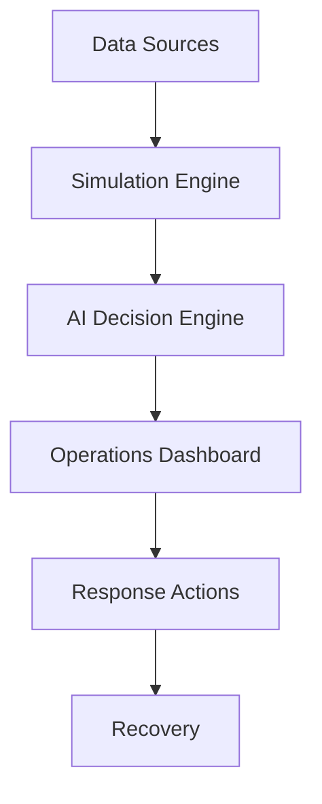
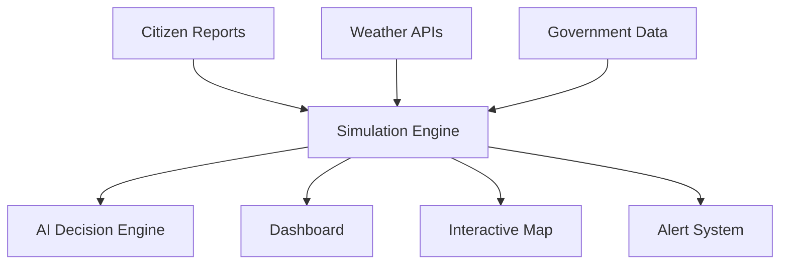
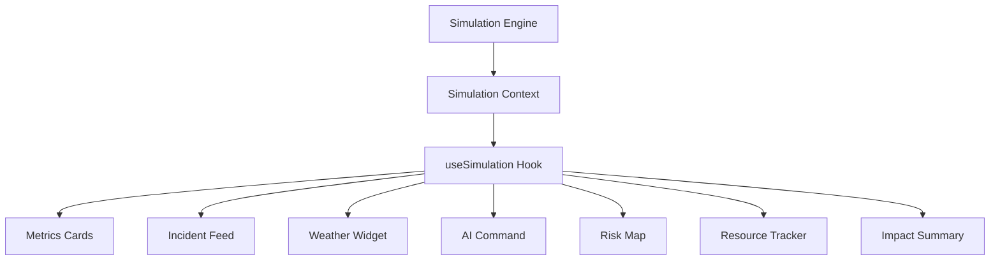
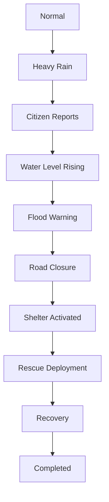
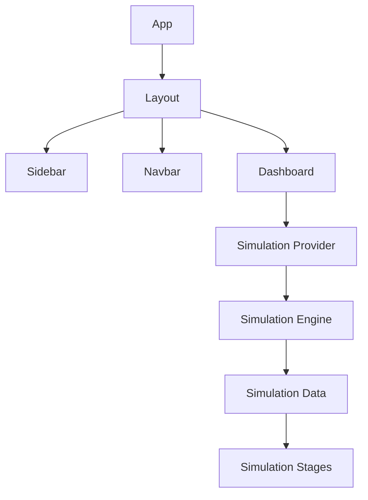
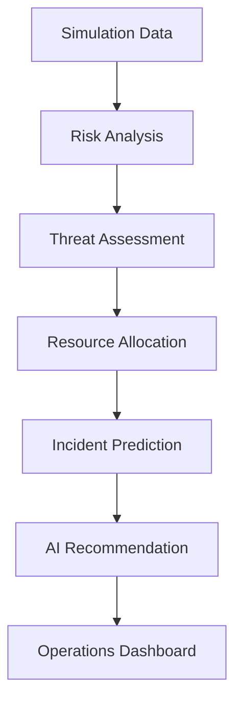

# CityNerve

**Full-Stack Disaster Intelligence & Emergency Operations Platform**

A mission-critical command platform that empowers disaster management agencies with real-time situational awareness, city-aware dashboards, simulation-driven planning, and a production-grade FastAPI backend connected to MongoDB Atlas.


<p align="center">
  
</p>

---

## About CityNerve

**CityNerve** is a full-stack disaster intelligence platform built for Emergency Operations Centers (EOCs). It combines a premium Next.js frontend with a production FastAPI backend and MongoDB Atlas to give command teams real-time situational awareness, city-specific incident tracking, and simulation-driven planning tools.

From the moment a disaster event begins, CityNerve surfaces the right data — active incidents, resource status, weather conditions, and population impact — in a unified, high-clarity interface designed for fast decision-making. City-aware dashboards adapt dynamically based on the selected municipality, and a stage-based simulation engine models how disasters escalate so operators can plan responses before they're needed.

---

## Why CityNerve?

Disaster response agencies today operate across fragmented tools: separate systems for weather, incident tracking, resource dispatch, and comms. In high-pressure situations, that fragmentation costs lives.

CityNerve consolidates everything into a single intelligent operations center:

- **Unified situational picture** — incidents, weather, and resources in one view
- **City-aware intelligence** — dashboards and data adapt per municipality
- **Simulation-first planning** — model disaster escalation before it happens
- **Backend-driven accuracy** — live API data from FastAPI + MongoDB Atlas, not just mocks
- **AI-ready architecture** — decision support and predictive analytics coming next

---

## Key Features

### Dashboard & Visualization
- Premium dark-mode operations dashboard with real-time-looking UI
- Multi-city support — switch between cities seamlessly
- Current location detection and city auto-selection
- Incident feed, weather widget, resource tracker, and impact summary
- Smooth micro-animations via Framer Motion

### Backend & Data
- FastAPI backend with structured Python/Pydantic architecture
- MongoDB Atlas cloud database — live connection established
- Cities API and Dashboard API — fully operational
- Frontend-to-backend integration with mock fallback when backend is unavailable
- Environment-variable-driven configuration (`.env` / `.env.local`)

### Simulation & Operations
- Stage-based disaster simulation flow (Normal → Warning → Active → Recovery)
- Simulation controls UI for triggering and advancing scenarios
- City-aware simulation direction in progress
- Designed for training, planning, and live ops support

### Maps & City Intelligence
- High-performance vector maps via MapLibre GL
- OpenStreetMap geographic data — free, open, and accurate
- Incident plotting, risk zones, and route overlays
- City-specific map centering and data overlays

### AI & Future Intelligence
- AI Decision Pipeline architecture defined
- Gemini API integration planned for predictive threat modeling
- Automated action recommendations and risk scoring — in roadmap

---

## Technology Stack

### Frontend
- **Next.js** — App Router, SSR, and API routes
- **React** — Component architecture and state management
- **TypeScript** — Strict type safety across the platform
- **Tailwind CSS** — Utility-first, responsive, premium dark-mode styling
- **shadcn/ui** — Accessible and customizable component primitives
- **Framer Motion** — Fluid micro-animations and transitions

### Maps
- **MapLibre GL** — Open-source, high-performance WebGL map rendering
- **OpenStreetMap** — Free and open geographic data

### Backend
- **FastAPI** — High-performance async Python API framework
- **Python** — Core backend runtime
- **Pydantic** — Request/response validation and settings management
- **Motor** — Async MongoDB driver for Python
- **MongoDB Atlas** — Cloud-hosted database with live connection

### AI *(Planned)*
- **Gemini API** — Decision support, predictive analytics, and threat modeling

### Deployment *(Planned)*
- **Vercel** — Frontend edge deployment and CI/CD
- **Railway / Render** — Backend hosting

---

## System Workflow



---

## Project Architecture

### 1. Overall System Architecture



### 2. Dashboard Data Flow



### 3. Disaster Simulation Flow



### 4. Application Architecture



### 5. AI Decision Pipeline



The frontend and backend run as separate services. The Next.js app communicates with the FastAPI server via REST APIs. MongoDB Atlas stores city, incident, and resource data. When the backend is unavailable, the frontend falls back to local mock data automatically — ensuring the dashboard is always usable.

### 6. Directory Structure

```text
citynerve/
├── app/                  # Next.js App Router pages and layouts
├── backend/              # FastAPI backend (Python)
│   ├── app/
│   │   ├── api/          # Route handlers (cities, dashboard, incidents)
│   │   ├── core/         # Configuration and settings
│   │   ├── database/     # MongoDB Atlas connection
│   │   ├── models/       # Database models
│   │   ├── schemas/      # Pydantic request/response schemas
│   │   └── services/     # Business logic layer
│   └── requirements.txt
├── components/           # Reusable UI components
│   ├── ai/               # AI reasoning and briefing panels
│   ├── cards/            # Incident and metric display cards
│   ├── layout/           # Dashboard shell, sidebar, and navigation
│   ├── map/              # MapLibre wrappers and layer controls
│   ├── panels/           # Control widgets (Weather, Resources, etc.)
│   └── shared/           # Generic buttons, badges, and base elements
├── constants/            # Configuration constants and theme setups
├── context/              # React Context providers (Simulation Engine)
├── data/                 # Mock datasets and simulation scenarios
├── hooks/                # Custom React hooks
├── lib/                  # Utility functions and generic helpers
├── public/               # Static assets and images
├── simulation/           # Simulation engine logic
└── types/                # TypeScript interface definitions
```

---

## Current Progress

### Completed
- [x] Premium landing page
- [x] Professional operations dashboard
- [x] Multi-city support with city switcher
- [x] Current location detection and auto city selection
- [x] Dynamic simulation UI and controls
- [x] Interactive map with MapLibre GL
- [x] Incident feed, weather widget, resource tracker, and impact summary
- [x] FastAPI backend initialized and structured
- [x] Python virtual environment configured
- [x] MongoDB Atlas connected successfully
- [x] Cities API — operational
- [x] Dashboard API — operational
- [x] Frontend-to-backend integration
- [x] Mock data fallback when backend is unavailable
- [x] Simulation engine architecture and stage-based disaster flow

### In Progress
- [ ] City-aware simulation direction and data binding
- [ ] Incident creation and management APIs
- [ ] Resource tracking APIs
- [ ] Expanding simulation stages with backend-driven data

### Upcoming
- [ ] AI decision support (Gemini API integration)
- [ ] Real-time updates via WebSockets
- [ ] Authentication and role-based access
- [ ] Citizen reporting integration
- [ ] Predictive analytics and threat scoring
- [ ] Production deployment (Vercel + backend hosting)

---

## Roadmap

| Phase | Milestone | Status |
| :---: | :--- | :---: |
| **Phase 1** | Frontend Dashboard & Interactive Map | ✅ Done |
| **Phase 2** | Simulation Engine & Stage-Based Flow | 🔄 In Progress |
| **Phase 3** | FastAPI Backend & MongoDB Atlas | ✅ Done |
| **Phase 4** | Incident, Resource & City APIs | 🔄 In Progress |
| **Phase 5** | AI Decision Support (Gemini API) | ⬜ Upcoming |
| **Phase 6** | Real-Time Updates & WebSockets | ⬜ Upcoming |
| **Phase 7** | Authentication & Production Deployment | ⬜ Upcoming |

---

## Getting Started

Both the frontend and backend must be running together for full functionality. The frontend will fall back to mock data automatically if the backend is not available.

### Prerequisites
- Node.js 18+
- Python 3.11+
- A MongoDB Atlas account and cluster URI

---

### Frontend

```bash
# 1. Clone the repository
git clone https://github.com/Aaryan-2903/CityNerve.git
cd citynerve

# 2. Install dependencies
npm install

# 3. Configure environment variables
# Create a .env.local file with your backend URL:
# NEXT_PUBLIC_API_URL=http://localhost:8000

# 4. Start the development server
npm run dev
```

Open [http://localhost:3000](http://localhost:3000) in your browser.

---

### Backend

```bash
# 1. Navigate to the backend directory
cd backend

# 2. Create and activate a virtual environment
python -m venv venv
venv\Scripts\activate        # Windows
# source venv/bin/activate   # macOS / Linux

# 3. Install Python dependencies
pip install -r requirements.txt

# 4. Configure environment variables
# Create a backend/.env file:
# MONGODB_URI=mongodb+srv://<user>:<password>@<cluster>.mongodb.net/citynerve
# DATABASE_NAME=citynerve

# 5. Start the FastAPI server
uvicorn app.main:app --reload --port 8000
```

API documentation is available at [http://localhost:8000/docs](http://localhost:8000/docs) once the server is running.

---

## Contributing

Contributions are welcome — whether it's new features, bug fixes, or documentation improvements.

1. Fork the repository
2. Create your feature branch (`git checkout -b feature/your-feature`)
3. Commit your changes (`git commit -m 'Add your feature'`)
4. Push to the branch (`git push origin feature/your-feature`)
5. Open a Pull Request

Please ensure your code follows the existing style guidelines and includes appropriate TypeScript type definitions.

---

## License

Distributed under the MIT License. See `LICENSE` for more information.

---

Built with ❤️ by **Aryan Mandal**

[GitHub Profile](https://github.com/Aaryan-2903)
