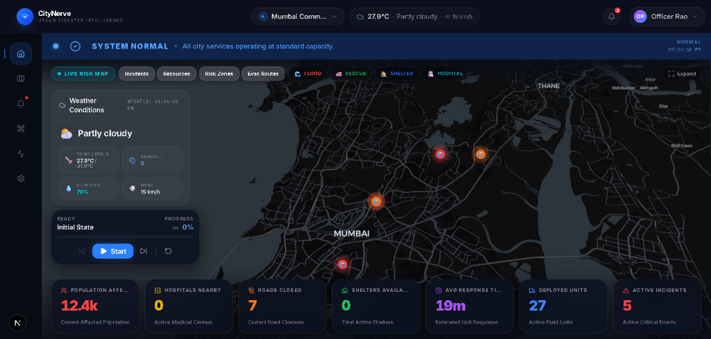
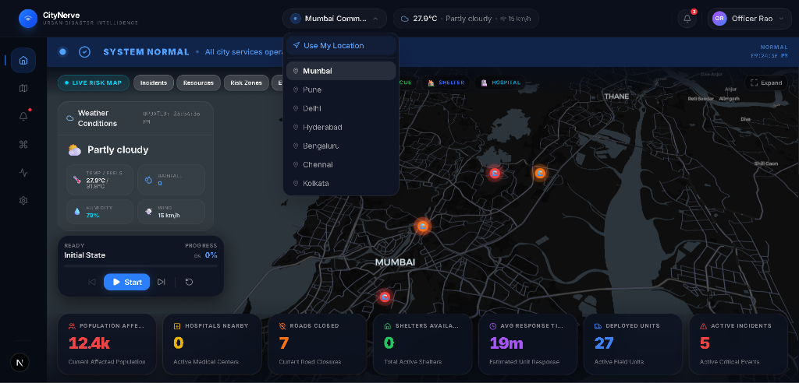
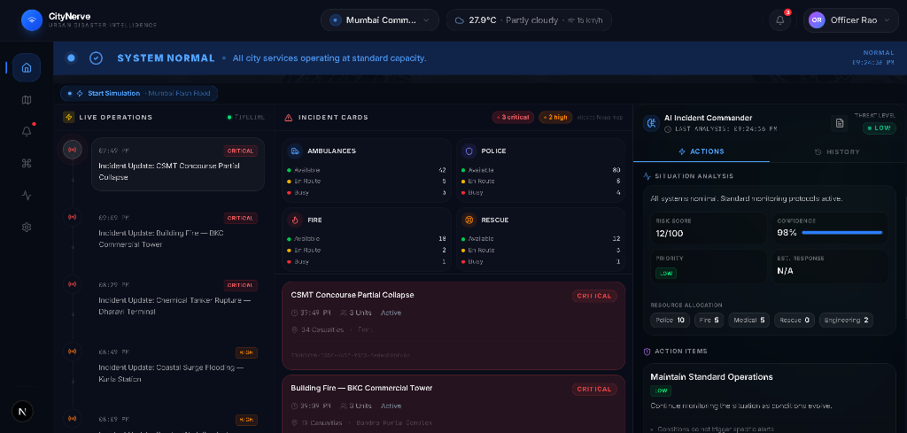
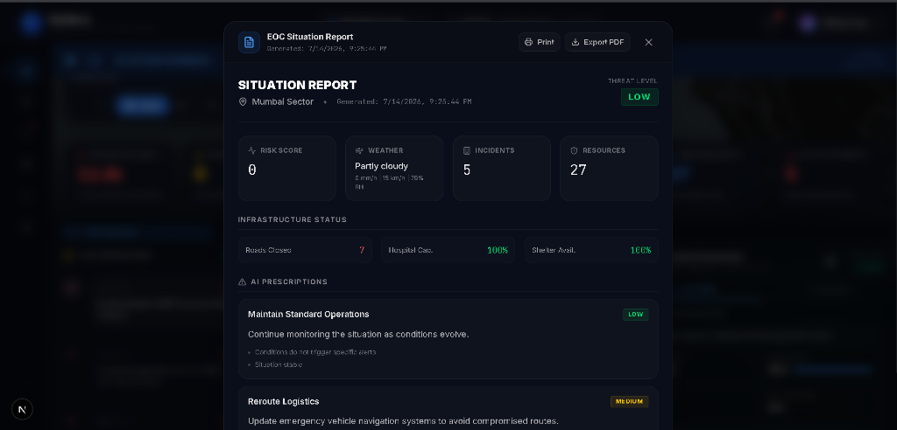
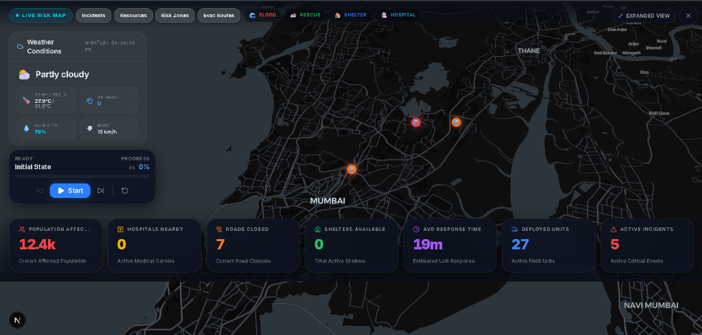
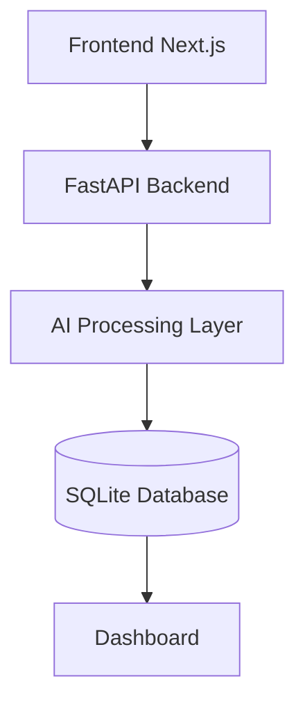
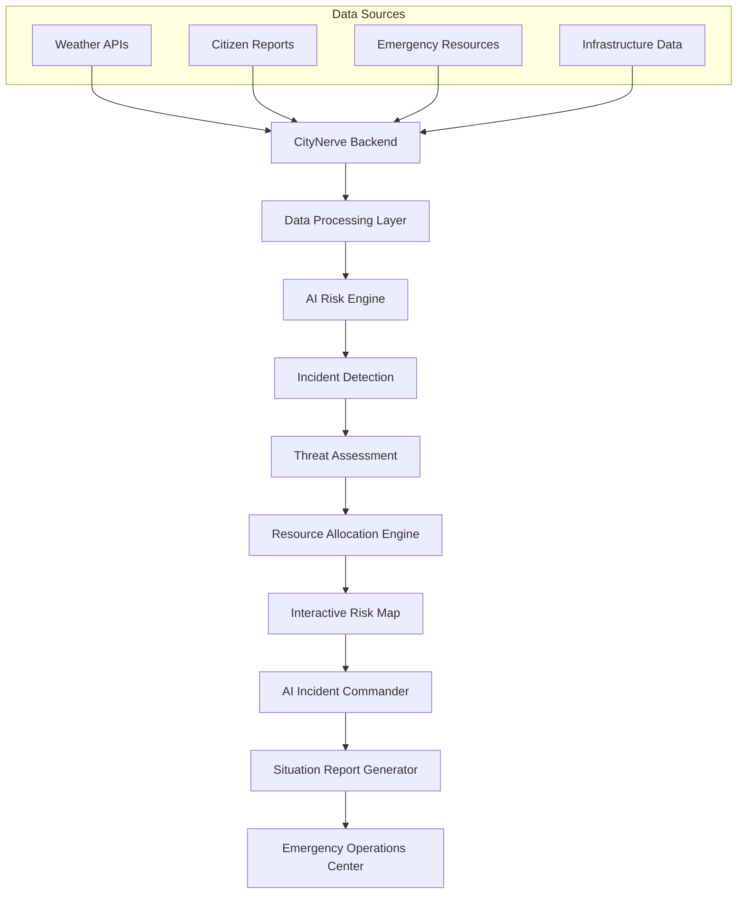
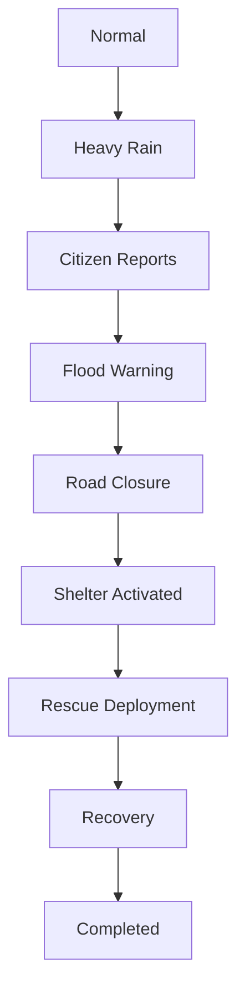
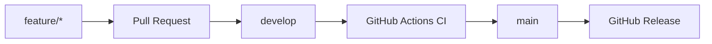

<!-- PROJECT SHIELDS -->
<div align="center">
  
  
  
  
  
  
  
  
</div>

<!-- PROJECT LOGO -->
<br />
<div align="center">
  <h1 align="center">CityNerve</h1>
  <p align="center">
    <strong>AI-Powered Urban Disaster Intelligence Platform</strong>
    <br />
    A mission-critical command platform empowering emergency operations centers with real-time situational awareness, dynamic AI decision-making, and simulation-driven response planning.
    <br />
    <br />
    <a href="#getting-started">Live Demo</a>
    ·
    <a href="#api">Documentation</a>
    ·
    <a href="https://github.com/Aaryan-2903/CityNerve/issues">Report Bug</a>
    ·
    <a href="https://github.com/Aaryan-2903/CityNerve/issues">Request Feature</a>
  </p>
</div>

<p align="center">
  
</p>

---

## 🌍 Overview

Disaster response agencies often operate using fragmented tools—separate systems for weather tracking, resource dispatch, and communication. In high-pressure emergency situations, fragmentation costs time and lives. 

**CityNerve** consolidates these critical data streams into a unified, intelligent command center. Designed for Emergency Operations Centers (EOCs), government agencies, and rapid response teams, CityNerve provides:

- **Unified Situational Picture**: Real-time integration of active incidents, weather intelligence, and emergency resources.
- **AI-Driven Decision Support**: Automated operational recommendations tailored to specific threat assessments.
- **Proactive Planning**: A powerful disaster simulation engine that models event escalation before it happens.

CityNerve transforms raw municipal data into actionable intelligence, ensuring response teams are always one step ahead of the crisis.

---

## ✨ Features

| Feature | Description |
| :--- | :--- |
| **Live Weather Intelligence** | Direct integration with live meteorological APIs for real-time wind, rainfall, and humidity data. |
| **Interactive Risk Map** | High-performance GIS visualization powered by MapLibre and OpenStreetMap. |
| **AI Incident Commander** | Intelligent recommendation engine for automated threat assessment and action protocols. |
| **Emergency Resource Management** | Live tracking and deployment logistics for police, fire, rescue, and medical units. |
| **Citizen Incident Reporting** | Ingest, categorize, and verify real-time incident reports from civilians. |
| **Disaster Simulation Engine** | Run localized disaster escalation models to train and prepare units. |
| **Situation Report Generator** | Instantly compile operational data into high-density Situation Reports (SITREP). |
| **Multi-City Dashboard** | Dynamic geographic data loading, allowing operators to switch seamlessly between cities. |
| **Infrastructure Monitoring** | Track critical urban infrastructure, including road closures and hospital capacities. |
| **Emergency Operations Center** | A vertical, time-stamped scrolling feed for comprehensive incident tracking. |
| **PDF Report Export** | Single-click export for distributing intelligence briefs and operational updates. |
| **Responsive Dashboard** | A premium, dark-mode EOC user interface tailored for all devices and massive command screens. |

---

## 🖼️ Gallery

### 1. Main Dashboard
The unified command center providing at-a-glance visibility into weather, resources, and live operations.


### 2. City Selection
Dynamic city switching capabilities, allowing operators to monitor multiple municipalities from a single platform.


### 3. Emergency Operations Center
Live incident monitoring with a real-time timeline, resource deployment tracking, and AI-driven action items.


### 4. Situation Report
AI-generated Situation Reports (SITREP) aggregating all live metrics, ready for PDF export and high-command distribution.


### 5. Interactive Risk Map
High-performance GIS visualization highlighting active incidents, critical risk zones, and infrastructure status.


---

## 🏗️ System Architecture



---

## ⚙️ CityNerve Workflow



---

## 🌪️ Disaster Simulation Workflow



---

## 💻 Tech Stack

| Category | Technology |
| :--- | :--- |
| **Frontend** | Next.js, React, TypeScript, TailwindCSS, shadcn/ui |
| **Backend** | Python, FastAPI, Pydantic, Uvicorn |
| **Database** | SQLite, SQLAlchemy |
| **Maps** | MapLibre GL, OpenStreetMap |
| **AI** | Custom AI Processing Layer & Rule Engine |
| **Deployment** | Node.js (Frontend Environment), Python Virtual Environments |

---

## 📂 Project Structure

```text
citynerve/
├── app/                  # Next.js App Router - Frontend UI, Pages, and Layouts
├── backend/              # FastAPI Python Server - Core API Logic and AI Engine
├── components/           # Reusable React UI Components (Dashboard, EOC, AI Commander)
├── data/                 # Static GeoJSON and seeding files for city infrastructure
├── docs/                 # Documentation, Diagrams, and Screenshot Gallery
├── public/               # Static Assets (Images, Icons)
├── simulation/           # Disaster Simulation Scripts & Escalation Scenarios
├── types/                # TypeScript Interfaces & Data Type Definitions
└── utils/                # Helper Functions, Formatting, and Geospatial Utilities
```

---

## 🔌 API

CityNerve features a robust, auto-documented REST API built on FastAPI. Access the Swagger UI locally at `http://127.0.0.1:8000/docs`.

### Important Endpoints:

- **Weather**: `GET /api/v1/weather/{city_name}` — Fetches live, cached weather data from Open-Meteo.
- **Incidents**: `GET /api/v1/incidents` — Retrieves active incident logs and threat levels.
- **Resources**: `GET /api/v1/resources` — Tracks live availability of emergency services (Police, Fire, Medical, Rescue).
- **Simulation**: `POST /api/v1/simulation/start` — Triggers a disaster event simulation in a target city.
- **Situation Reports**: `GET /api/v1/dashboard/{city_name}` — Aggregates all live metrics for the EOC dashboard.

---

## 🚀 Getting Started

### Prerequisites
- **Node.js** 18+
- **Python** 3.11+

### 1. Clone
```bash
git clone https://github.com/Aaryan-2903/CityNerve.git
cd citynerve
```

### 2. Install Frontend
```bash
npm install
```

### 3. Install Backend
```bash
cd backend
python -m venv venv

# Windows:
venv\Scripts\activate
# macOS / Linux:
# source venv/bin/activate

pip install -r requirements.txt
cd ..
```

### 4. Environment Variables
Create a `.env.local` file in the root directory:
```env
NEXT_PUBLIC_API_URL=http://127.0.0.1:8000
```
*(No database configuration is needed! The backend automatically initializes a local SQLite `app.db` and seeds it on startup.)*

### 5. Run Application
You can run both the Next.js frontend and the FastAPI backend concurrently using the provided npm script:
```bash
npm run dev
```

- **Dashboard**: [http://localhost:3000/dashboard](http://localhost:3000/dashboard)
- **API Docs**: [http://127.0.0.1:8000/docs](http://127.0.0.1:8000/docs)

---

## 🔄 Open Source Development Workflow



---

## 🛣️ Roadmap

### Completed
- [x] Premium operations dashboard and responsive EOC UI
- [x] Full FastAPI backend structure with SQLite and SQLAlchemy
- [x] Live Open-Meteo weather integration with local caching
- [x] AI Incident Commander (Recommendation Engine)
- [x] Multi-city support with dynamic geographic data loading
- [x] Interactive map (MapLibre) with live infrastructure plotting
- [x] Emergency Operations Timeline & Resource Status Grid

### Future
- [ ] Direct-to-PDF Situation Report generation (SITREP Export)
- [ ] LLM Integration for advanced dynamic reasoning
- [ ] Real-time operational sync via WebSockets
- [ ] Authentication and role-based access control
- [ ] Automated CI/CD pipeline and GitHub Actions workflows

---

## 🤝 Contributing

We welcome contributions to make CityNerve even better! Please follow our established process:

1. **Feature Branches**: Create a branch from `develop` (`git checkout -b feature/your-feature`)
2. **Pull Requests**: Submit your PR with a clear description of the changes.
3. **CI**: Ensure your code passes standard linting and formatting.
4. **Issue Templates**: Use our GitHub issue templates to report bugs or request features.
5. **Code Reviews**: All PRs must be reviewed by maintainers before merging.

---

## 📄 License

Distributed under the MIT License. See `LICENSE` for more information.

---

## ✍️ Author

Made with ❤️ by **Aryan Mandal**

- [GitHub](https://github.com/Aaryan-2903)
- [LinkedIn](https://www.linkedin.com/in/aryan-mandal/)
