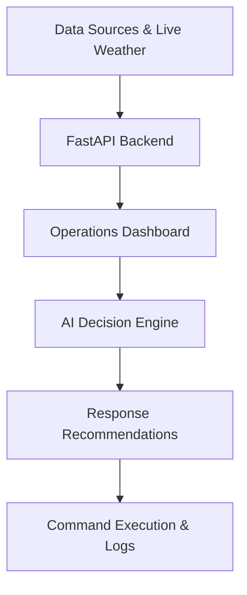

# CityNerve

**Full-Stack Disaster Intelligence & Emergency Operations Platform**

A mission-critical command platform that empowers disaster management agencies with real-time situational awareness, city-aware dashboards, simulation-driven planning, and a production-grade FastAPI backend connected to SQLite.


<p align="center">
  
</p>

---

## About CityNerve

**CityNerve** is a full-stack disaster intelligence platform built for Emergency Operations Centers (EOCs). It combines a premium Next.js frontend with a robust Python FastAPI backend and SQLite database to give command teams real-time situational awareness, city-specific incident tracking, and AI-driven decision support.

From the moment a disaster event begins, CityNerve surfaces the right data — active incidents, resource status, live weather conditions, and population impact — in a unified, high-clarity interface designed for fast decision-making. City-aware dashboards adapt dynamically based on the selected municipality, and the integrated AI Incident Commander models how disasters escalate so operators can plan responses effectively.

*(Note: CityNerve previously used MongoDB, but has been successfully migrated to a lightweight and embedded SQLite + SQLAlchemy architecture for simplified local deployment and robust relational data modeling).*

---

## Why CityNerve?

Disaster response agencies today operate across fragmented tools: separate systems for weather, incident tracking, resource dispatch, and comms. In high-pressure situations, that fragmentation costs lives.

CityNerve consolidates everything into a single intelligent operations center:

- **Unified situational picture** — incidents, live weather, and resources in one view
- **AI Incident Commander** — intelligent rule-based engine providing real-time operational recommendations
- **City-aware intelligence** — dashboards and data adapt per municipality
- **Simulation-first planning** — model disaster escalation before it happens
- **Backend-driven accuracy** — live API data powered by FastAPI, with automated data seeding

---

## Key Features

### Dashboard & EOC UI
- Premium dark-mode operations dashboard with professional EOC aesthetics.
- Multi-city support — switch between cities seamlessly.
- **Live Operations Timeline**: Vertical scrolling feed for tracking dispatches, reports, and alerts.
- **Resource Status Grid**: Real-time availability tracking for Police, Fire, Ambulance, and Rescue units.
- **Live Alert Banner**: Automatically highlights critical warnings based on threat levels and live conditions.
- Smooth micro-animations, glassmorphism, and responsive layout scaling across all devices.

### AI Incident Commander & Analytics
- **Rule-Based Recommendation Engine**: Analyzes system state (risk score, weather, hospital capacity) and automatically generates actionable prescriptions (e.g. "Recommend Evacuation Readiness" or "Deploy Flood Barriers").
- **Decision History Log**: Keeps an immutable, scrollable ledger of all accepted or dismissed AI commands.
- **Situation Report Export**: Instantly compiles a high-density, printable Situation Report (SITREP) aggregating all live metrics.

### Backend & Data Integration
- FastAPI backend built with Python, Pydantic, and SQLAlchemy.
- Relational SQLite database with automated seeding on startup.
- **Live Weather Integration**: Direct connection to Open-Meteo API for real-time rainfall, wind speed, and humidity, which dynamically trigger AI recommendations.
- Stable API structure offering comprehensive endpoints (e.g., `/api/v1/cities`, `/api/v1/dashboard/{city}`).

### Maps & Spatial Intelligence
- High-performance vector maps via MapLibre GL.
- OpenStreetMap geographic data — free, open, and accurate.
- Incident plotting, risk zones, and dynamic route overlays automatically adjusting to city bounds.

---

## Technology Stack

### Frontend
- **Next.js** (App Router, SSR) & **React**
- **TypeScript**
- **Tailwind CSS**, **shadcn/ui**, **Framer Motion** (for fluid animations)
- **MapLibre GL** & **OpenStreetMap**

### Backend
- **FastAPI** — High-performance async Python API framework
- **SQLAlchemy** & **SQLite** — Relational database modeling and storage
- **Pydantic** — Request/response validation
- **httpx** — For external API integrations (e.g., Open-Meteo)

---

## API Overview

When the backend is running, the interactive API documentation is automatically generated and accessible via Swagger UI at `http://127.0.0.1:8000/docs`.

### Core Endpoints:
- `GET /api/v1/cities` — Retrieves a list of all supported cities.
- `GET /api/v1/dashboard/{city_name}` — Returns baseline aggregated metrics for the dashboard (e.g., `/api/v1/dashboard/mumbai`).
- `GET /api/v1/weather/{city_name}` — Fetches live, cached weather data from Open-Meteo for the specified city.
- `GET /api/v1/incidents`, `/api/v1/resources`, `/api/v1/poi` — Fetch related operational entities.

---

## System Workflow



---

## Current Development Status

### Completed
- [x] Premium operations dashboard and responsive EOC UI
- [x] Full FastAPI backend structure with SQLite and SQLAlchemy
- [x] Successful migration from MongoDB to SQLite for simplified deployments
- [x] Live Open-Meteo weather integration with local caching
- [x] AI Incident Commander (Rule-Based Recommendation Engine)
- [x] Multi-city support with dynamic geographic data loading
- [x] Interactive map (MapLibre) with fullscreen bug fixes and stable rendering
- [x] Live Timeline Feed, Resource Status Grid, and Alert Banners
- [x] Production build passes completely

### Upcoming / Roadmap
- [ ] LLM Integration (replacing the rule engine with Gemini for dynamic reasoning)
- [ ] Real-time operational sync via WebSockets
- [ ] Authentication and role-based access control
- [ ] Automated CI/CD pipeline and GitHub Actions workflows
- [ ] Direct-to-PDF Situation Report generation

---

## Getting Started

CityNerve comes configured with a concurrent startup script so you can launch both the frontend and the backend simultaneously using a single command. 

### Prerequisites
- **Node.js** 18+
- **Python** 3.11+

### 1. Installation

```bash
# Clone the repository
git clone https://github.com/Aaryan-2903/CityNerve.git
cd citynerve

# Install frontend dependencies
npm install

# Setup backend virtual environment
cd backend
python -m venv venv

# Activate virtual environment
# Windows:
venv\Scripts\activate
# macOS / Linux:
# source venv/bin/activate

# Install backend dependencies
pip install -r requirements.txt

# Return to root directory
cd ..
```

### 2. Configuration
Create a `.env.local` file in the root directory:
```env
NEXT_PUBLIC_API_URL=http://127.0.0.1:8000
```
No database configuration is needed for the backend as it automatically initializes a local SQLite `app.db` and seeds it on startup!

### 3. Run Locally

Start both the Next.js frontend and the FastAPI backend simultaneously from the root directory:

```bash
npm run dev
```

- **Dashboard**: [http://localhost:3000/dashboard](http://localhost:3000/dashboard)
- **API Docs**: [http://127.0.0.1:8000/docs](http://127.0.0.1:8000/docs)

*(Note: The `npm run dev` script uses `concurrently` to launch both services. If you prefer to run them separately, you can use `npm run frontend` and `npm run backend` in different terminal tabs).*

---

## Continuous Integration (CI) / Workflows

While CityNerve is currently in active development, we are preparing a robust CI/CD pipeline using **GitHub Actions**. Future workflows will include:
- **Type Checking**: Automated `tsc` execution for Next.js to ensure strict typings.
- **Backend Testing**: Automated `pytest` execution for the FastAPI backend and SQLite models.
- **Linting & Formatting**: Enforcing `eslint` and `black` code standards.

---

## Contributing

Contributions are welcome — whether it's new features, bug fixes, or documentation improvements.

1. Fork the repository
2. Create your feature branch (`git checkout -b feature/your-feature`)
3. Commit your changes (`git commit -m 'Add your feature'`)
4. Push to the branch (`git push origin feature/your-feature`)
5. Open a Pull Request

Please ensure your code follows the existing style guidelines and includes appropriate TypeScript type definitions.

---

## License

Distributed under the MIT License. See `LICENSE` for more information.

---

Built with ❤️ by **Aryan Mandal**

[GitHub Profile](https://github.com/Aaryan-2903)
